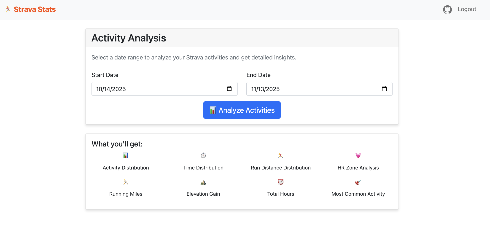
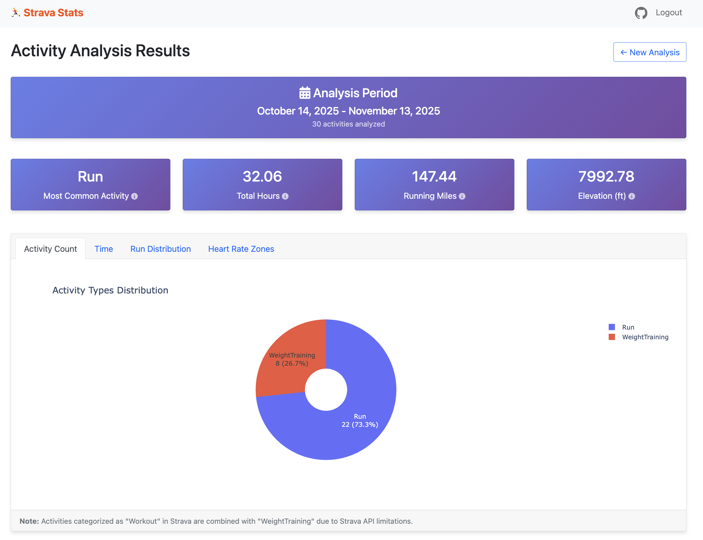
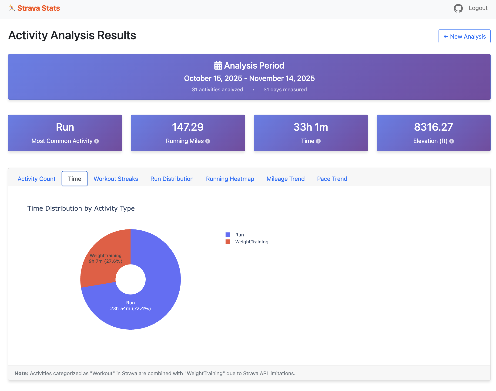
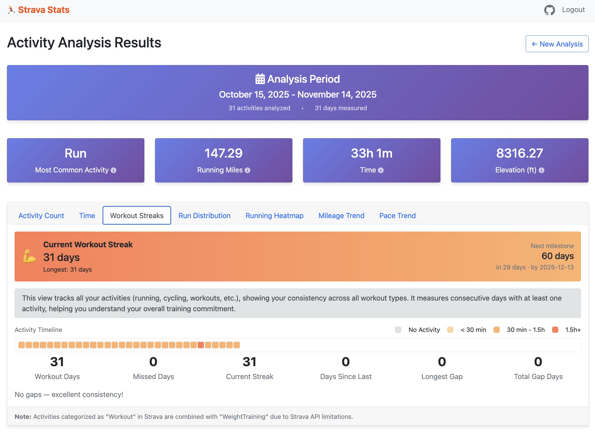
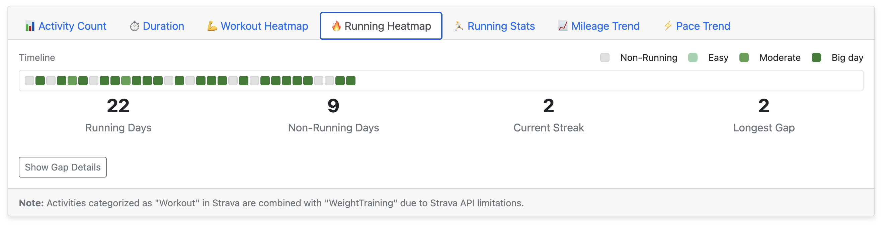
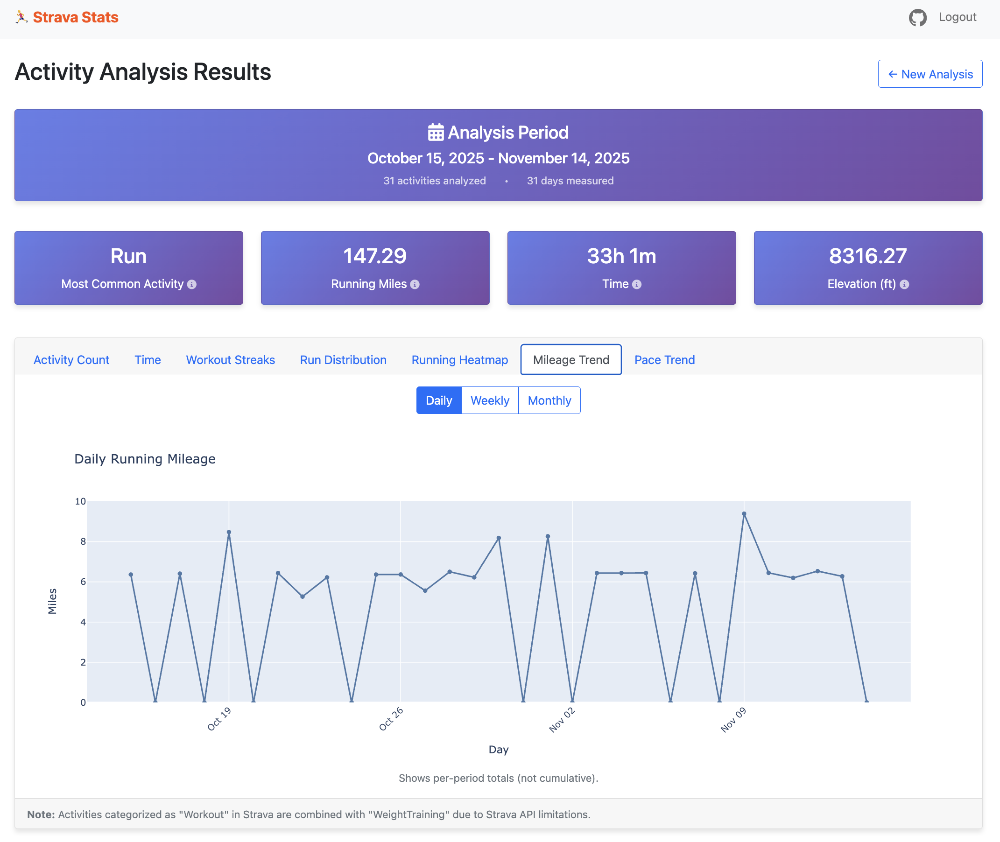
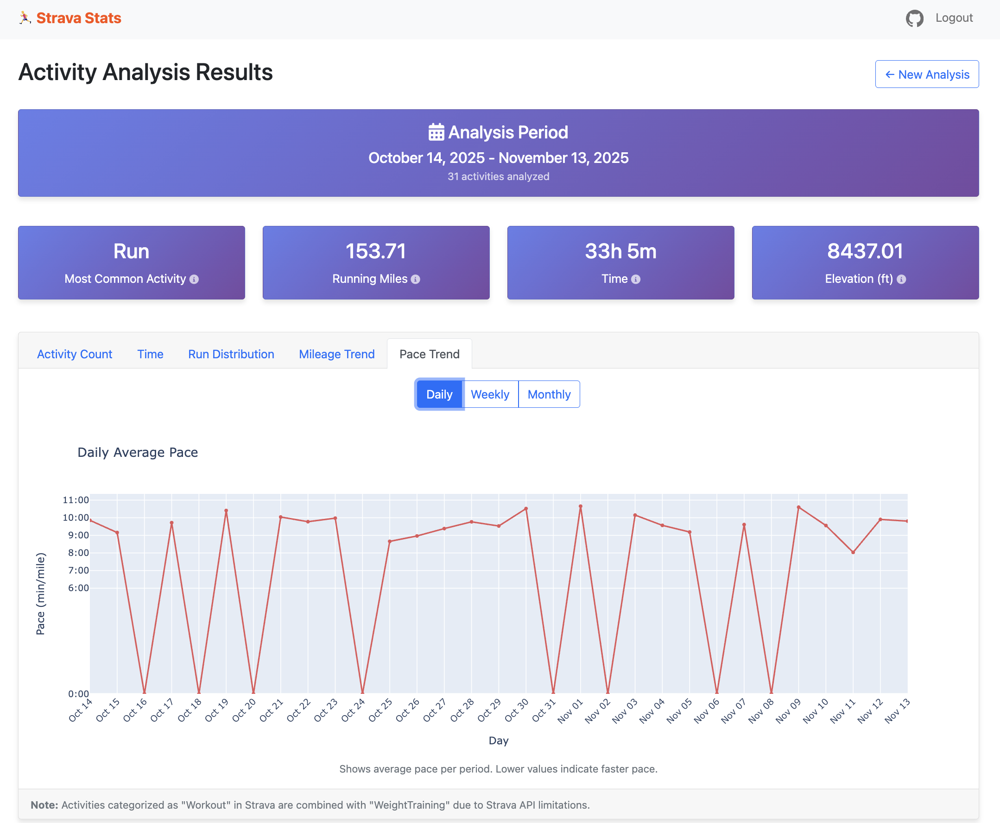

# Strava Stats Web Application

A Python Flask web application that connects to your Strava account and provides detailed analytics about your activities including activity distribution, time tracking, running metrics, pace analysis, personal records, and consistency tracking through heatmaps.

## Features

- 🔐 Secure Strava OAuth authentication
- 📊 Interactive tabbed interface with 7 comprehensive views:
  - **Activity Count Distribution**: Pie chart showing activity types with counts and percentages
  - **Time Distribution**: Pie chart showing time spent per activity type (HH:MM format)
  - **Workout Streaks**: Heatmap tracking all activities with hours-based intensity visualization
  - **Run Distribution**: Bar chart with 1-mile bins + running summary card showing:
    - Total Runs & 10K+ Runs count
    - Total Miles & Average Pace
    - Personal Records: Best mile split, fastest 10K, longest run, most elevation
  - **Running Heatmap**: Visual calendar colored by daily mileage intensity, track running streaks and gaps
  - **Mileage Trend**: Daily/Weekly/Monthly running mileage with adaptive x-axis labeling
  - **Pace Trend**: Daily/Weekly/Monthly average pace in MM:SS format, continuous line showing rest days
- 📈 Advanced visualizations:
  - Adaptive date labeling prevents cluttered x-axes on long date ranges
  - Weekly charts show week numbers and start dates
  - Monthly charts show month names (e.g., "Jan 2024")
  - Heatmaps automatically wrap to avoid horizontal scrolling
- 🎯 Quick date presets: Last 7/30/90 Days, Last 6 Months, Last Year, Year to Date
- 🏃‍♂️ Comprehensive running metrics and personal records tracking
- ⛰️ Elevation gain tracking and peak elevation identification
- 📅 Custom date range selection with intuitive UI
- 📱 Responsive web interface with Bootstrap styling

## Screenshots

### Input Page


### Dashboard


### Time Distribution


### Workout Streaks


### Run Distribution


### Running Heatmap


### Mileage Trend


### Pace Trend


## Quick Start

Get up and running in 3 steps:

1. **Clone the repository**
   ```bash
   git clone https://github.com/arun-gupta/strava-stats.git
   cd strava-stats
   ```

2. **Configure environment variables**
   ```bash
   cp .env.example .env
   # Edit .env and add your Strava credentials
   # Generate FLASK_SECRET_KEY: python3 -c "import secrets; print(secrets.token_hex(32))"
   ```

3. **Run the quickstart script**
   ```bash
   ./quickstart.sh
   ```

That's it! The application will be available at `http://localhost:3000`

The quickstart script automatically:
- Creates virtual environment
- Installs all dependencies
- Validates configuration
- Starts the application

## Manual Setup Instructions

### 1. Create a Strava Application

1. Go to [Strava Developers](https://developers.strava.com/)
2. Click "Create & Manage Your App"
3. Fill in the application details:
   - **Application Name**: Strava Stats
   - **Category**: Data Importer
   - **Club**: Leave blank
   - **Website**: http://localhost:3000
   - **Authorization Callback Domain**: localhost
4. Note down your **Client ID** and **Client Secret**

### 2. Virtual Environment Setup

**Create the virtual environment:**
```bash
cd strava-stats
python3 -m venv venv
```

**Activate the virtual environment:**
```bash
source activate.sh
```

**Or manually:**
```bash
source venv/bin/activate
```

**Install dependencies:**
```bash
pip install -r requirements.txt
```

**To deactivate when done:**
```bash
deactivate
```

### 3. Configure Environment Variables

1. Copy the example environment file:
```bash
cp .env.example .env
```

2. Generate a Flask secret key:
```bash
python3 -c "import secrets; print(secrets.token_hex(32))"
```

3. Edit `.env` and add your Strava credentials and the generated secret key:
```
STRAVA_CLIENT_ID=your_actual_client_id
STRAVA_CLIENT_SECRET=your_actual_client_secret
FLASK_SECRET_KEY=your_generated_secret_key_here
```

### 4. Run the Application

**Option 1: Quick Start (Recommended)**
```bash
./quickstart.sh
```
This script handles everything: creates venv, installs dependencies, and starts the app.

**Option 2: Run script (if already set up)**
```bash
./run.sh
```
Stops any existing Flask processes and starts a new one.

**Option 3: Manual**
```bash
source venv/bin/activate
python app.py
```

The application will be available at `http://localhost:3000`

## Usage

1. **Connect to Strava**: Click the "Connect with Strava" button and authorize the application
2. **Select Date Range**: Use quick presets (Last 7/30/90 Days, Last 6 Months, Last Year, Year to Date) or choose custom start and end dates
3. **View Results**: Get comprehensive analytics across 7 tabs:
   - **Activity Count**: Pie chart showing activity types with counts and percentages
   - **Time**: Pie chart showing time spent per activity type in HH:MM format
   - **Workout Streaks**: Heatmap showing all activities with hours-based intensity, track workout consistency across all activity types
   - **Run Distribution**:
     - Bar chart with 1-mile distance bins
     - Running summary card with total runs, 10K+ runs, total miles, and average pace
     - Personal records: Best mile split, fastest 10K, longest run, most elevation gain
   - **Running Heatmap**: Visual calendar colored by daily mileage intensity, track running streaks, gaps, and consistency
   - **Mileage Trend**: Daily/weekly/monthly running mileage with adaptive x-axis labeling
   - **Pace Trend**: Daily/weekly/monthly average pace in MM:SS format, continuous line showing rest days at 0:00

## API Rate Limits

The application respects Strava's API rate limits:
- 100 requests per 15 minutes
- 1,000 requests per day

For large date ranges with many activities, the app may take some time to fetch all data.

## Known Limitations

- **Activity Type Categorization**: Due to Strava API behavior, some activities may be categorized as "Workout" instead of their specific type (e.g., "WeightTraining"). The application automatically combines "Workout" activities with "WeightTraining" for consistency.

## Troubleshooting

### Common Issues

1. **Authentication Error**: Ensure your Strava app's callback domain is set to `localhost`
2. **No Activities Found**: Check that you have activities in the selected date range
3. **Slow Loading**: Large date ranges with many activities may take time to fetch due to Strava API rate limits

### Environment Variables

Make sure all required environment variables are set in your `.env` file:
- `STRAVA_CLIENT_ID`: Your Strava app's client ID
- `STRAVA_CLIENT_SECRET`: Your Strava app's client secret  
- `FLASK_SECRET_KEY`: A random secret key for Flask sessions

## Security Notes

- Never commit your `.env` file to version control
- Use a strong, random secret key for production deployments
- Consider using environment-specific configuration for production

## License

This project is licensed under the Apache License 2.0 - see the [LICENSE](LICENSE) file for details.

Please respect Strava's API terms of service and rate limits when using this application.