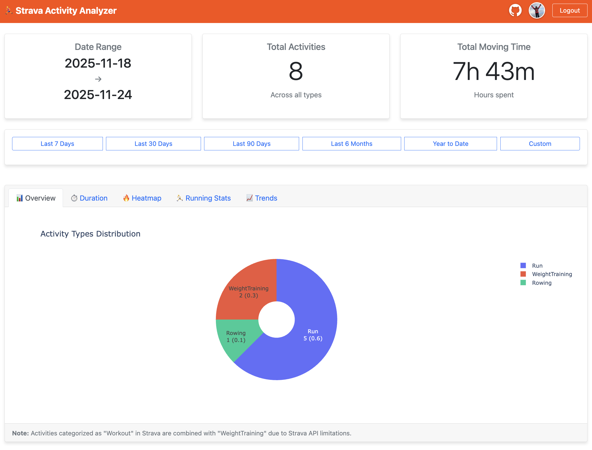
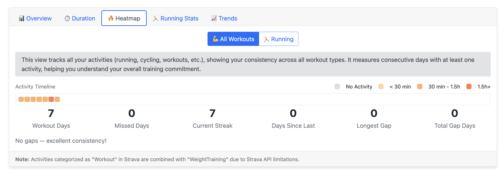
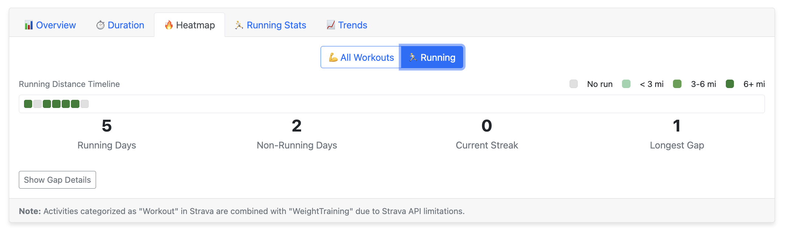
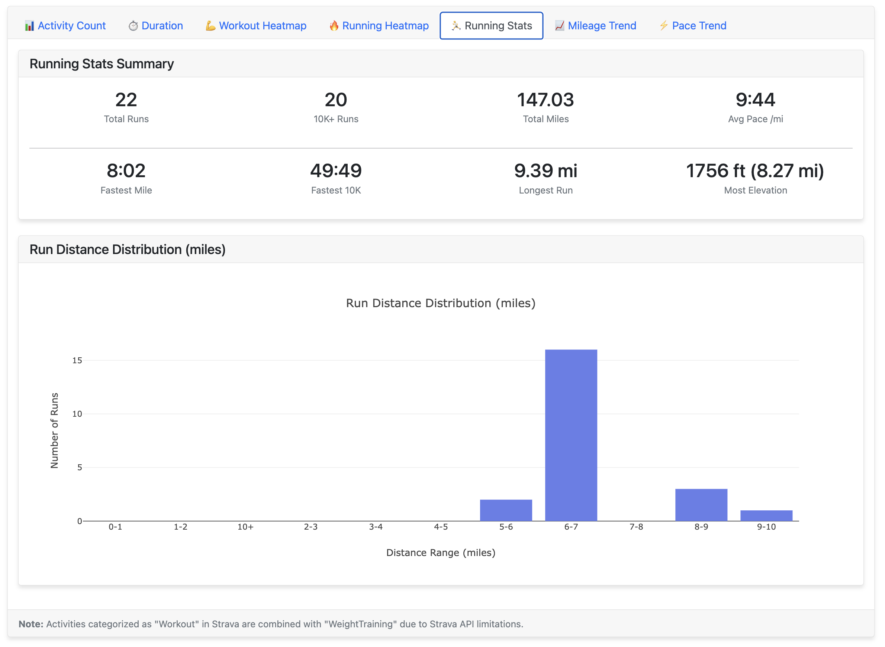
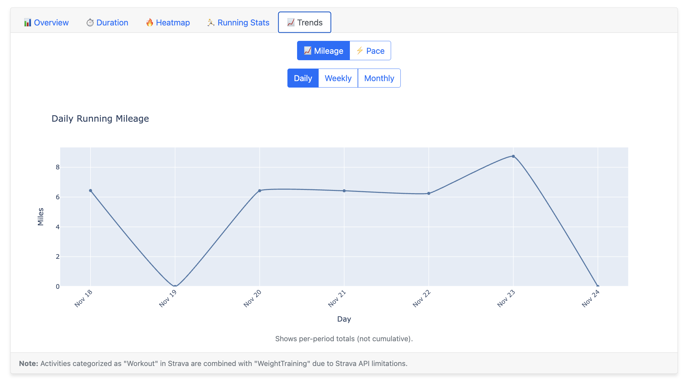
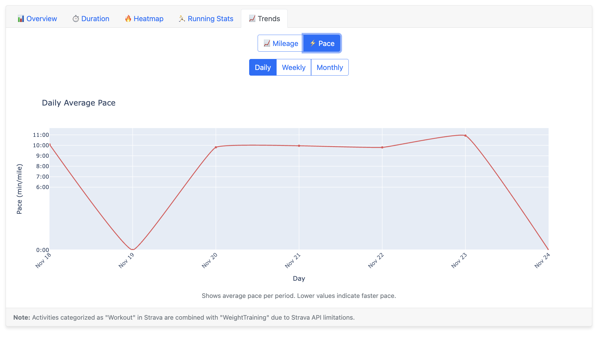

# Strava Activity Analyzer (Python)

A Python Flask web application that connects to your Strava account and provides detailed analytics about your activities including activity distribution, time tracking, running metrics, pace analysis, personal records, and consistency tracking through heatmaps.

## Features

- 🔐 Secure Strava OAuth authentication with profile display (photo and name in navbar)
- 📊 Interactive tabbed interface with 5 comprehensive views:
  - **📊 Overview**: Pie chart showing activity types with counts and percentages
  - **⏱️ Duration**: Pie chart showing time spent per activity type (HH:MM format)
  - **🔥 Heatmap**: Toggle between two visualization modes:
    - **💪 All Workouts**: Visual calendar tracking all activities with hours-based intensity
    - **🏃 Running**: Visual calendar colored by daily mileage intensity (< 3 mi, 3-6 mi, 6+ mi), track running streaks and gaps
  - **🏃 Running Stats**: Comprehensive running metrics displayed in a compact grid format:
    - Summary stats: Total Runs, 10K+ Runs, Total Miles, Average Pace
    - Personal Records: Fastest mile, fastest 10K, longest run, most elevation
    - Bar chart showing run distance distribution with 1-mile bins
  - **📈 Trends**: Toggle between two trend views:
    - **📈 Mileage**: Daily/Weekly/Monthly running mileage with adaptive x-axis labeling
    - **⚡ Pace**: Daily/Weekly/Monthly average pace in MM:SS format, continuous line showing rest days
- 📋 Summary cards showing Total Activities, Total Distance, and Active Days at a glance
- 📈 Advanced visualizations:
  - Adaptive date labeling prevents cluttered x-axes on long date ranges
  - Weekly charts show week numbers and start dates
  - Monthly charts show month names (e.g., "Jan 2024")
  - Heatmaps automatically wrap to avoid horizontal scrolling
- 🎯 Streamlined date selection integrated into results page:
  - Quick presets: Last 7/30/90 Days, Last 6 Months, Last Year, Year to Date
  - Custom date range picker with instant updates
  - Default view shows last 30 days on first load
- 🏃‍♂️ Comprehensive running metrics and personal records tracking
- ⛰️ Elevation gain tracking and peak elevation identification
- 📱 Responsive web interface with Bootstrap styling

## Screenshots

<table>
  <tr>
    <td width="25%"><a href="images/overview.png"></a><br/><sub>Overview</sub></td>
    <td width="25%"><a href="images/duration.png"></a><br/><sub>Duration</sub></td>
    <td width="25%"><a href="images/heatmap-all.png"></a><br/><sub>All Workouts Heatmap</sub></td>
    <td width="25%"><a href="images/heatmap-running.png"></a><br/><sub>Running Heatmap</sub></td>
  </tr>
  <tr>
    <td width="25%"><a href="images/running-stats.png"></a><br/><sub>Running Stats</sub></td>
    <td width="25%"><a href="images/trends-mileage.png"></a><br/><sub>Mileage Trend</sub></td>
    <td width="25%"><a href="images/trends-pace.png"></a><br/><sub>Pace Trend</sub></td>
    <td width="25%"></td>
  </tr>
</table>

<sub>Click any image to view full size</sub>

## Quick Start

Get up and running in 3 steps:

1. **Clone the repository**
   ```bash
   git clone https://github.com/arun-gupta/strava-stats.git
   cd strava-stats
   ```

2. **Configure environment variables**
   ```bash
   cp .env.example .env
   # Edit .env and add your Strava credentials
   # Generate FLASK_SECRET_KEY: python3 -c "import secrets; print(secrets.token_hex(32))"
   ```

3. **Run the quickstart script**
   ```bash
   ./quickstart.sh
   ```

That's it! The application will be available at `http://localhost:3000`

The quickstart script automatically:
- Creates virtual environment
- Installs all dependencies
- Validates configuration
- Starts the application

> **Need more control?** See [Manual Setup Instructions](MANUAL_SETUP.md) for step-by-step configuration.

## Usage

1. **Connect to Strava**: Click the "Connect with Strava" button and authorize the application
2. **View Your Stats**: The app loads immediately with your last 30 days of activities
3. **Adjust Date Range**: Use the integrated date picker at the top to:
   - Click quick presets (Last 7/30/90 Days, Last 6 Months, Last Year, Year to Date)
   - Choose custom start and end dates
   - Click "Update Analysis" to refresh the data
4. **Explore Your Data**: Navigate through 5 comprehensive tabs:
   - **📊 Overview**: Pie chart showing activity types with counts and percentages
   - **⏱️ Duration**: Pie chart showing time spent per activity type in HH:MM format
   - **🔥 Heatmap**: Toggle between All Workouts (hours-based) and Running (mileage-based) heatmaps
   - **🏃 Running Stats**: Comprehensive grid showing total runs, 10K+ runs, total miles, average pace, and personal records (fastest mile, fastest 10K, longest run, most elevation), plus distance distribution bar chart
   - **📈 Trends**: Toggle between Mileage and Pace trends with daily/weekly/monthly granularity

## API Rate Limits

The application respects Strava's API rate limits:
- 100 requests per 15 minutes
- 1,000 requests per day

For large date ranges with many activities, the app may take some time to fetch all data.

## Known Limitations

- **Activity Type Categorization**: Due to Strava API behavior, some activities may be categorized as "Workout" instead of their specific type (e.g., "WeightTraining"). The application automatically combines "Workout" activities with "WeightTraining" for consistency.

## Troubleshooting

### Common Issues

1. **Authentication Error**: Ensure your Strava app's callback domain is set to `localhost`
2. **No Activities Found**: Check that you have activities in the selected date range
3. **Slow Loading**: Large date ranges with many activities may take time to fetch due to Strava API rate limits

For detailed setup troubleshooting, see [Manual Setup Instructions](MANUAL_SETUP.md).

## Security Notes

- Never commit your `.env` file to version control
- Use a strong, random secret key for production deployments
- Consider using environment-specific configuration for production

## License

This project is licensed under the Apache License 2.0 - see the [LICENSE](LICENSE) file for details.

Please respect Strava's API terms of service and rate limits when using this application.